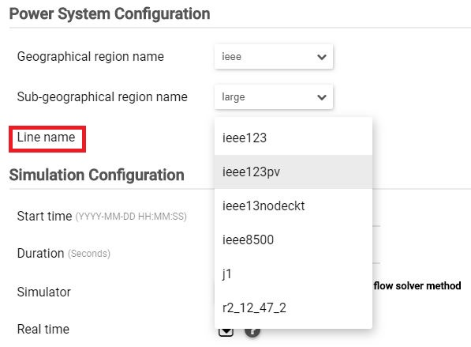

With the platform running, use curl to load the file into Blazegraph.

.. code-block:: bash

  curl -s -D- -H 'Content-Type: application/xml' --upload-file 'model.xml' -X POST 'http://localhost:8889/bigdata/sparql'

..

Once the model is uploaded to Blazegraph, the new model will be shown in the Simulation Configuration Form in the visualization under the line name dropdown. If the Viz app was already open, you will need to restart the browser to see the new model(This is due to caching).

	
