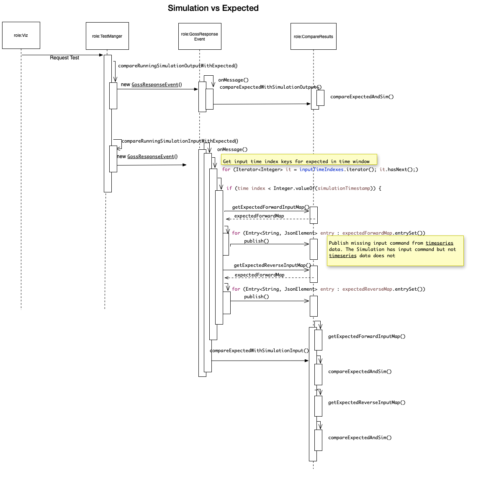
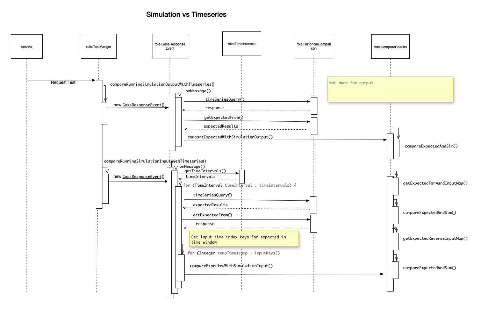
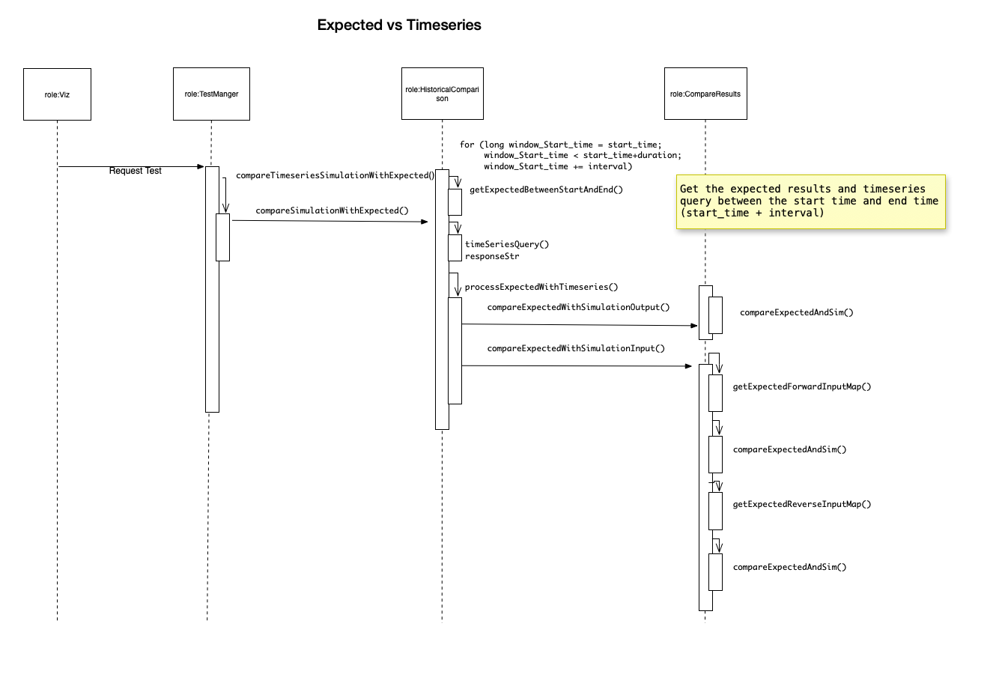

The Test Manager is responsible for testing an application or service against different events or scenarios.
The Test Manager Configuration is sent as part of the RequestSimulation. The expected results and events are sent to the Test Manager for processing.

1. Test Configuration

The test configuration contains:

#. The application ID which is the name of the application. 
#. The testId with will be generated if one is not provided.
#. The test type with is one of the following "simulation_vs_expected", "simulation_vs_timeseries", "expected_vs_timeseries", or "timeseries_vs_timeseries"
#. The compareWithSimId which is the simulation ID to compare against in the timeseries DB.
#. The compareWithSimIdTwo which is the second simulation ID to compare against in the timeseries DB.
#. The rules settings.
#. The expected results which is a json dictionary of times with expected results for inputs and outputs.
#. The events which contain commands or faults that are scheduled when a simulation runs.

.. code-block:: JSON
    :caption: Test Config Example

    {
        "appId": "sample_app",
        "testId": "382642088",
        "compareWithSimId": "431673998",
        "start_time": 1248156000,
        "duration": 60,
        "interval": 10,
        "expectedResults": {},
        "testType": "expected_vs_timeseries"
    }

1. Expected results series

The expected results is a dictonary of input and output dictionaries that contains measurements at each time key.

.. code-block:: JSON
   :caption: Expected results example

    "expectedResults": {
        "output": {
        "1248156002": {
            "simulation_id": "559402036",
            "message": {
                "timestamp": 1535574871,
                "measurements": [
                {
                    "measurement_mrid": "_000b01a1-8238-4372-95c0-82aad26ea311",
                    "angle": -5.066423674487563,
                    "magnitude": 2388.676720682955,
                    "simulation_id": "1961648576",
                    "time": 1248156002},
                    {
                    "measurement_mrid": "_00347396-b4b0-4218-9aba-b363f2cda841",
                    "angle": 118.66041090126667,
                    "magnitude": 2425.0820667756834,
                    "simulation_id": "1961648576",
                    "time": 1248156002},
                    {
                    "measurement_mrid": "_0044ae64-1c72-4e81-b412-d7349ce267d3",
                    "angle": -39.42744945710241,
                    "magnitude": 374545.4981119089,
                    "simulation_id": "1961648576",
                    "time": 1248156002}
                ]
            }
            }
        },
        "input": {
        "1248156014": {
            "simulation_id": "559402036",
            "message": {
            "timestamp": 1248156014,
            "measurements": [
                {"hasMeasurementDifference": "FORWARD",
                "difference_mrid": "1fae379c-d0e2-4c80-8f2c-c5d7a70ff4d4",
                "simulation_id": "1961648576",
                "time": 1248156014,
                "attribute": "ShuntCompensator.sections",
                "value": 1.0,
                "object": "_939CA567-AA3D-4972-AABC-1D0AAF4859FE"},
                {"hasMeasurementDifference": "REVERSE",
                "difference_mrid": "1fae379c-d0e2-4c80-8f2c-c5d7a70ff4d4",
                "simulation_id": "1961648576",
                "time": 1248156014,
                "attribute": "ShuntCompensator.sections",
                "value": 0.0,
                "object": "_939CA567-AA3D-4972-AABC-1D0AAF4859FE"}
            ]
            }
        },
        "1248156029": {
            "simulation_id": "559402036",
            "message": {
            "timestamp": 1248156029,
            "measurements": [
                {"hasMeasurementDifference": "FORWARD",
                "difference_mrid": "1fae379c-d0e2-4c80-8f2c-c5d7a70ff4d4",
                "simulation_id": "1961648576",
                "time": 1248156029,
                "attribute": "ShuntCompensator.sections",
                "value": 0.0,
                "object": "_939CA567-AA3D-4972-AABC-1D0AAF4859FE"},
                {"hasMeasurementDifference": "REVERSE",
                "difference_mrid": "1fae379c-d0e2-4c80-8f2c-c5d7a70ff4d4",
                "simulation_id": "1961648576",
                "time": 1248156029,
                "attribute": "ShuntCompensator.sections",
                "value": 1.0,
                "object": "_939CA567-AA3D-4972-AABC-1D0AAF4859FE"}
            ]
            }
        },
        "1248156044": {
            "simulation_id": "559402036",
            "message": {
            "timestamp": 1248156044,
            "measurements": [
                {"hasMeasurementDifference": "FORWARD",
                "difference_mrid": "1fae379c-d0e2-4c80-8f2c-c5d7a70ff4d4",
                "simulation_id": "1961648576",
                "time": 1248156044,
                "attribute": "ShuntCompensator.sections",
                "value": 0.0,
                "object": "_939CA567-AA3D-4972-AABC-1D0AAF4859FE"},
                {"hasMeasurementDifference": "REVERSE",
                "difference_mrid": "1fae379c-d0e2-4c80-8f2c-c5d7a70ff4d4",
                "simulation_id": "1961648576",
                "time": 1248156044,
                "attribute": "ShuntCompensator.sections",
                "value": 1.0,
                "object": "_939CA567-AA3D-4972-AABC-1D0AAF4859FE"}
            ]
            }
        }
        }
    }
..

3. The test types and sequnece diagrams

The sequenece diagrams are included to aid with understanding how the test manager is handling each test case. 

The simulation versus expected case listens for simulation output data and compares with the expected data at the simulation time. 
It also listens for simulation input data and compares with the expected data at the simulation time. 

The simulation versus timeseries case listens for simulation output data and compares with the expected data at created from querying the timeseries database at the simulation time.
It also listens for simulation input data and compares with the expected data created from querying the timeseries database at the simulation time. 

The expected versus timeseries case breaks the expected data and timeseries data query into chunks and then compares the expected data with output and input expected data created from querying the timeseries database.

The timeseries versus timeseries case case breaks both timeseries data queries into chunks and then compares the with output and input expected data created from querying the timeseries database.

1. Running a Test

To run a test agains a running simulation then create a Simulation Config and add a Test Config with a the TestType as "simulation_vs_expected" or "simulation_vs_timeseries".

To run a test without test manager with TestType as "expected_vs_timeseries" or "timeseries_vs_timeseries" and send to "goss.gridappsd.simulation.test.input."

.. code-block:: JSON
    :caption: Test Config Example

    {
        "appId": "sample_app",
        "testId": "382642088",
        "compareWithSimId": "431673998",
        "compareWithSimIdTwo": "231673900",
        "start_time": 1248156000,
        "duration": 60,
        "interval": 10,
        "expectedResults": {},
        "testType": "timeseries_vs_timeseries"
    }
..

4. Test Results

   The results of a test will be streamed to /topic/goss.gridappsd.simulation.test.output.<TestID> and will list the values that do not match at each time index.

   The fields om the Test Result are as follows:

   #. object: String - object MRID 
   #. diffType:String - FORWARD or REVERSE
   #. indexOne:Long - Time of expected 
   #. expected:String - Expected value
   #. simulationTimestamp:Long - Simulation timestamp
   #. actual:String - Actual value
   #. diffMrid:String - Diff MRID
   #. indexTwo:Long - Time of actual value
   #. attribute:String - CIM attribute or FORWARD or REVERSE
   #. match:Boolean - True of the expected and actual match

..

.. code-block:: 
    :caption: Test Result Example

    [
    {'status': 'start'}
    {'object': '_0044ae64-1c72-4e81-b412-d7349ce267d3', 'attribute': 'magnitude', 'indexOne': 1248156002, 'indexTwo': 1248156002, 'simulationTimestamp': 0, 'expected': '374545.4981119089', 'actual': '54911.42414314939', 'diffMrid': 'NA', 'diffType': 'NA', 'match': False}
    {'object': '_000b01a1-8238-4372-95c0-82aad26ea311', 'attribute': 'angle', 'indexOne': 1248156002, 'indexTwo': 1248156002, 'simulationTimestamp': 0, 'expected': '-5.066423674487563', 'actual': '21.91525592241816', 'diffMrid': 'NA', 'diffType': 'NA', 'match': False}
    {'object': '_000b01a1-8238-4372-95c0-82aad26ea311', 'attribute': 'magnitude', 'indexOne': 1248156002, 'indexTwo': 1248156002, 'simulationTimestamp': 0, 'expected': '2388.676720682955', 'actual': '23182.721945577698', 'diffMrid': 'NA', 'diffType': 'NA', 'match': False}
    {'object': '_939CA567-AA3D-4972-AABC-1D0AAF4859FE', 'attribute': 'FORWARD value', 'indexOne': 1248156014, 'indexTwo': 1248156014, 'simulationTimestamp': 0, 'expected': '1.0', 'actual': '0', 'diffMrid': '661ff0c3-43ed-4351-905b-43874c9003a4', 'diffType': 'FORWARD', 'match': False}
    {'object': '_939CA567-AA3D-4972-AABC-1D0AAF4859FE', 'attribute': 'REVERSE value', 'indexOne': 1248156014, 'indexTwo': 1248156014, 'simulationTimestamp': 0, 'expected': '0.0', 'actual': '1', 'diffMrid': '661ff0c3-43ed-4351-905b-43874c9003a4', 'diffType': 'REVERSE', 'match': False}
    {'object': '_939CA567-AA3D-4972-AABC-1D0AAF4859FE', 'attribute': 'FORWARD value', 'indexOne': 1248156029, 'indexTwo': 1248156029, 'simulationTimestamp': 0, 'expected': '0.0', 'actual': '1', 'diffMrid': '97ad4c0d-8e04-42a0-a244-c38f33724974', 'diffType': 'FORWARD', 'match': False}
    {'object': '_939CA567-AA3D-4972-AABC-1D0AAF4859FE', 'attribute': 'REVERSE value', 'indexOne': 1248156029, 'indexTwo': 1248156029, 'simulationTimestamp': 0, 'expected': '1.0', 'actual': '0', 'diffMrid': '97ad4c0d-8e04-42a0-a244-c38f33724974', 'diffType': 'REVERSE', 'match': False}
    {'status': 'finish'}
    ]
..

