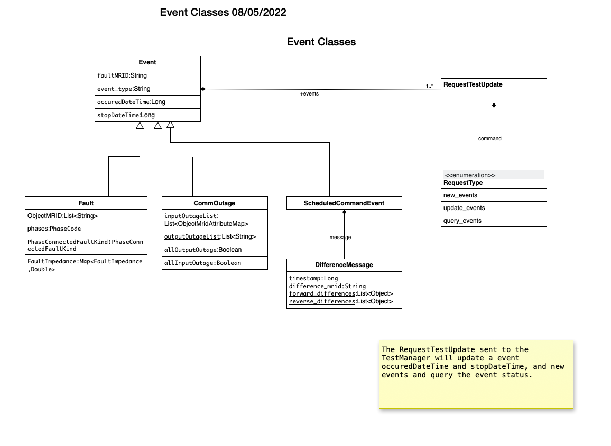

There are 3 types events supported by the TestManager and the platform:

    1. CIM defined fault events, used when a line is down or for taking a piece of equipment out of service.  
    2. Communication outage events which simulates measurements or control message outages.
    3. Scheduled command at specific time which sends commands to a piece of equipment.

There are 2 commands to the TestManager:

    1. Update
    2. QueryStatus
    

|event_classes_image0|

Fault Events
^^^^^^^^^^^^

Fault Events are defined in a Test Script and define the CIM Fault events that will be intialized and cleared at scheduled times.

The phases string is all the combinations of the 3-phases plus neutral and secondary phases.
Some examples are :

1. "A"
2. "AN" would be line to line.
3. "AB" would be line to line.
4. "S12N" both hot wires to ground
5. "S12" both hot wires together.
 
PhaseConnectedFaultKind is an enumeration with the following values:

1.	lineToGround
2.	lineToLine
3.	lineToLineToGround
4.	lineOpen

.. code-block:: none
    :caption: Fault Events in Test Script JSON schema

    {
        "PhaseConnectedFaultKind": string,
        "FaultImpedance": {
            "rGround": float,
            "xGround": float,
            "rLineToLine":float,
            "xLineToLine":float
        },
        "ObjectMRID": [string],
        "phases": string,
        "event_type": string,
        "occuredDateTime": long,
        "stopDateTime": long
    }
..

.. code-block:: JSON
   :caption: Fault Event Example in test script

    {   
        "command": "new_events",
        "events" : [{
                "PhaseConnectedFaultKind": "lineToGround",
                "FaultImpedance": {
                                "rGround": 0.001,
                                "xGround": 0.001
                },
                "ObjectMRID": ["_9EF94B67-7279-21F4-5CEE-B2724E3C3FE6"],
                "phases": "ABC",
                "event_type": "Fault",
                "occuredDateTime": 1248130809,
                "stopDateTime": 1248130816
            }
        ]
    }
..

Fault Commands sent from the Test Manager to the simulation

.. code-block:: JSON
   :caption: Initialize a Fault Command example

    {
        "command": "update", 
        "input": {
            "timestamp": 1553201000414, 
            "reverse_differences": [], 
            "difference_mrid": "_ee4e4055-222f-4ccf-bed1-93063bd4392c", 
            "forward_differences": [
            {
                "ObjectMRID": "12344", 
                "FaultImpedance": {
                "xLineToLine": 0.0, 
                "rGround": 0.001, 
                "rLineToLine": 0.0, 
                "xGround": 0.001
                }, 
                "faultMRID": "1233", 
                "PhaseCode": "AN", 
                "PhaseConnectedFaultKind": "lineToGround"
            }
            ]
        }
    }
..

.. code-block:: JSON
   :caption: Clear a Fault Command example

    {
        "command": "update", 
        "input": {
            "timestamp": 1553201003561, 
            "reverse_differences": [
            {
                "ObjectMRID": "12344", 
                "FaultImpedance": {
                "xLineToLine": 0.0, 
                "rGround": 0.001, 
                "rLineToLine": 0.0, 
                "xGround": 0.001
                }, 
                "faultMRID": "1233", 
                "PhaseCode": "AN", 
                "PhaseConnectedFaultKind": "lineToGround"
            }
            ], 
            "difference_mrid": "_00b4668d-8454-4f1c-aed9-42d1424af149", 
            "forward_differences": []
        }
    }
..

Communication Event
^^^^^^^^^^^^^^^^^^^

Communication Outage events are separate from the CIM events but have occuredDateTime and stopDateTime. 

1. The inputOutageList is the list of objectMRID and attribute pair.  The objectMRID is anything that can be controllable and specific control attribute i.e. "RegulatingControl.mode". 
2. The outputOutageList is the list of MRIDs for the measurement device that is associated to the . 
3. If allInputOutage is True the inputOutageList is not needed as all inputs to the simulator are blocked.
4. If allOutputOutage is True the outputOutageList is not needed as all outputs from the simulator are blocked.

.. code-block::  none
   :caption: JSON Communication Outage schema command for the TestManager

    {  
        "allOutputOutage": boolean,
        "allInputOutage": boolean,
        "inputOutageList": [{"objectMRID":string, "attribute":string}],
        "outputOutageList": [string],
        "event_type": string,
        "occuredDateTime": long,
        "stopDateTime": long
    }
..

.. code-block::  JSON
   :caption: JSON Communication Outage command for the TestManager

   {"command": "new_events",
    "events": [
        {
            "allOutputOutage": false,
            "allInputOutage": false,
            "inputOutageList": [{"objectMRID":"_EF2FF8C1-A6A6-4771-ADDD-A371AD929D5B", "attribute":"ShuntCompensator.sections"}, {"objectMRID":"_C0F73227-012B-B70B-0142-55C7C991A343", "attribute":"ShuntCompensator.sections"}],
            "outputOutageList": ["_5405BE1A-BC86-5452-CBF2-BD1BA8984093"],
            "event_type": "CommOutage",
            "occuredDateTime": 1248130819,
            "stopDateTime": 1248130824
        }
    ]
    }
..

For reference this is the complete JSON schema of the internal Communication Event for the platform and goes between the Test Manager and the fncs_goss_bridge.py.

.. code-block:: JSON
   :caption: Communication Event to the Simulation Bridge

    {
    "command": "CommOutage",
    "input": {
        "timestamp": 1248130819,
        "forward_differences": [
        {
            "allOutputOutage": false,
            "allInputOutage": false,
            "inputOutageList": [
            {
                "objectMRID": "_EF2FF8C1-A6A6-4771-ADDD-A371AD929D5B",
                "attribute": "ShuntCompensator.sections"
            },
            {
                "objectMRID": "_C0F73227-012B-B70B-0142-55C7C991A343",
                "attribute": "ShuntCompensator.sections"
            }
            ],
            "outputOutageList": [
            "_5405BE1A-BC86-5452-CBF2-BD1BA8984093"
            ],
            "faultMRID": "_ce5ee4c9-9c41-4f5e-8c5c-f19990f9cfba",
            "event_type": "CommOutage",
            "occuredDateTime": 1248130819,
            "stopDateTime": 1248130824
        }
        ],
        "reverse_differences": []
    }
    }
..

The object will be the EventID generated by TestManager

Updating Events
^^^^^^^^^^^^^^^

Events can be updated with the "update_events" command and the list of events to be updated. 
This is used to update the occuredDateTime and stopDateTime.

.. code-block::  none
    :caption: JSON update command to Test Manager
    :emphasize-lines: 6

    {  
        "command": "update_events",
        "events":[{<Event>}]
        }
    }
..

Query
^^^^^
The Test Manager can be queried the for list of faults and statuses.
The return is the fault MRID and status which can be SCHEDULED, INITIATED, CLEARED, or CANCELLED.

.. code-block:: none
    :caption: Query the for list of faults and status

    {"command":"query_events", "simulationID":int}
..

.. code-block:: none
    :caption: Result JSON Schema

    { 
        "data": [
            {
                <fault>,
                "status": <status>  # SCHEDULED, INITIATED, CLEARED, CANCELLED
            }
        ]
    }
..

.. code-block:: JSON
    :caption: Result CIM Fault Events example

    { 
        "data": [
            {
            "allOutputOutage": false,
            "allInputOutage": false,
            "inputOutageList": [
                {
                "objectMRID": "_EF2FF8C1-A6A6-4771-ADDD-A371AD929D5B",
                "attribute": "ShuntCompensator.sections"
                },
                {
                "objectMRID": "_C0F73227-012B-B70B-0142-55C7C991A343",
                "attribute": "ShuntCompensator.sections"
                }
            ],
            "outputOutageList": [
                "_5405BE1A-BC86-5452-CBF2-BD1BA8984093"
            ],
            "faultMRID": "_ce5ee4c9-9c41-4f5e-8c5c-f19990f9cfba",
            "event_type": "CommOutage",
            "occuredDateTime": 1248130819,
            "stopDateTime": 1248130824,
            "status": "CLEARED"
            }
        ]
    }
..

Scheduled Commands
^^^^^^^^^^^^^^^^^^

Commands that can be scheduled for a specific point in time of the simulation.  This can be used to trigger a fault like behavior like change the taps of a regular or mimicking behavior of protective devices like a recloser with a with a switch.  

.. code-block:: none
    :caption: JSON scheduled command schema

    {   
        "command": "new_events",
        "events":[{
                "message":{
                    "forward_differences":[<Object>],
                    "reverse_differences":[<Object>]
                },
                "occuredDateTime":long,
                "stopDateTime":long,
        }]
    }
..

.. code-block:: JSON
    :caption: Scheduled command example

    {
        "command": "new_events",
        "events":[{
            "message": {
                "forward_differences": [
                    {
                    "object": "_8D0EAC3F-AD56-C5A6-ED03-863DBB4A8C5F",
                    "attribute": "ShuntCompensator.sections",
                    "value": "0"
                    }
                ],
                "reverse_differences": [
                    {
                    "object": "_8D0EAC3F-AD56-C5A6-ED03-863DBB4A8C5F",
                    "attribute": "ShuntCompensator.sections",
                    "value": "1"
                    }
                ]
            },
            "event_type": "ScheduledCommandEvent",
            "occuredDateTime": 1248130812,
            "stopDateTime": 1248130842
            }]
    }
..

